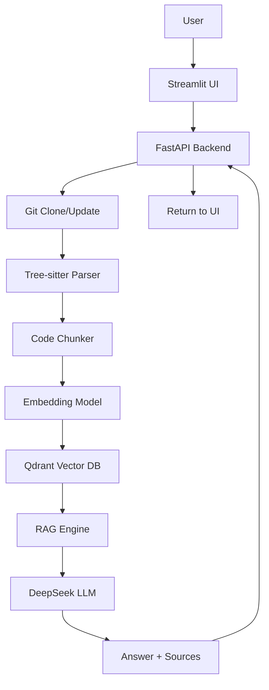

# 🤖 CodeRAG: Chat with GitHub Repositories

**Chat with your GitHub repositories using Retrieval-Augmented Generation (RAG) and code-aware context.**

This project enables you to ask natural language questions about any GitHub repository and get precise answers with source code references. It's designed for onboarding new developers and understanding complex codebases quickly.

---

## 🔍 Features

- **Code-Aware RAG**: Understands functions, classes, and dependencies using AST parsing
- **Semantic Search**: Find relevant code snippets using vector embeddings
- **Graph Traversal**: Expands context with dependency graphs (+1 hop)
- **GitHub Permalinks**: Answers include direct links to source code
- **Streaming Responses**: Real-time chat experience
- **Multi-Language Support**: Works with Python, JavaScript, TypeScript, Java, Go, and more
- **FastAPI Backend**: RESTful API with streaming support
- **Streamlit UI**: Interactive web interface

---

## 🏗️ Architecture



### Components

1. **Backend (Python)**
   - FastAPI server with REST endpoints
   - RAG engine with semantic + graph search
   - Ingestion pipeline for indexing repos
   - Tree-sitter parser for AST-aware code chunks

2. **Frontend (Streamlit)**
   - Web UI for chatting and searching
   - Repository management
   - Real-time streaming responses

3. **Infrastructure**
   - Qdrant for vector storage
   - Docker for containerization

---

## 🛠️ Tech Stack

| Layer       | Technology         |
|-------------|--------------------|
| Backend     | Python, FastAPI    |
| Frontend    | Streamlit          |
| Parsing     | tree-sitter        |
| Embeddings  | Sentence Transformers |
| Vector DB   | Qdrant             |
| LLM         | DeepSeek V4        |
| Container   | Docker             |

---

## 🚀 Quick Start

### Prerequisites

- Docker & Docker Compose
- Python 3.9+
- Git

### Installation

1. Clone the repository:
```bash
git clone https://github.com/yourusername/coderg.git
cd coderg
```

2. Copy environment file:
```bash
cp .env.example .env
```

3. Build and start services:
```bash
docker-compose up --build
```

4. Access the UI:
   - Backend API: http://localhost:8000
   - Streamlit UI: http://localhost:8501

---

## 📦 Project Structure

```
.
├── backend/                 # FastAPI backend
│   ├── app/
│   │   ├── api/             # API endpoints
│   │   ├── core/            # Core logic (RAG, LLM, embedding, vector store)
│   │   ├── ingestion/       # Ingestion pipeline
│   │   ├── models/          # Pydantic models
│   │   └── main.py          # FastAPI app entrypoint
│   └── requirements.txt
├── frontend/                # Streamlit UI
│   └── streamlit_app.py
├── data/                    # Data storage
│   ├── qdrant_storage/      # Qdrant persistent storage
│   └── repos/               # Cloned repositories
├── grammars/                # tree-sitter language grammars
├── docker-compose.yml
├── Dockerfile
├── Dockerfile.ui
└── README.md
```

---

## 🧠 How It Works

1. **Ingestion Pipeline**
   - Clone or update repository
   - Parse files with tree-sitter (AST-aware)
   - Chunk code by symbols (functions, classes)
   - Build dependency graph
   - Embed and index into Qdrant

2. **RAG Process**
   - Semantic search in Qdrant
   - Expand with graph neighbors (+1 hop)
   - Build augmented prompt
   - Query DeepSeek LLM
   - Parse answer for source references

3. **Response Format**
   ```json
   {
     "answer": "The auth function checks JWT token validity...",
     "sources": [
       {
         "file_path": "auth/utils.py",
         "start_line": 42,
         "end_line": 55,
         "symbol_name": "validate_token",
         "github_url": "https://github.com/user/repo/blob/main/auth/utils.py#L42"
       }
     ]
   }
   ```

---

## 📡 API Endpoints

### Chat
- `POST /api/chat` - Synchronous chat
- `POST /api/chat/stream` - Streaming chat

### Repository
- `POST /api/repo/clone` - Clone/update and index repo
- `GET /api/repo/status/{repo_url}` - Get indexing status
- `GET /api/repo/list` - List all repos

### Search
- `POST /api/search` - Direct vector search

### Health
- `GET /api/health` - Service health check

---

## 🎯 Example Usage

1. Enter a GitHub repo URL in the sidebar
2. Click "Clone & Index"
3. Ask questions like:
   - "How does the login flow work?"
   - "Show me the database connection code"
   - "What are the dependencies of User model?"

4. Get answers with:
   - Natural language explanation
   - Code snippets
   - GitHub permalinks to source

---

## ⚙️ Configuration

Edit `.env` file:

```env
# Backend settings
HOST=0.0.0.0
PORT=8000
DEBUG=false
RELOAD=true
ALLOWED_ORIGINS=http://localhost:8501,http://localhost:3000

# Qdrant settings
QDRANT_HOST=qdrant
QDRANT_PORT=6333

# LLM settings
DEEPSEEK_API_KEY=your_api_key_here
EMBEDDING_MODEL=thenlper/gte-small
```

---

## 🧪 Testing

Run tests:
```bash
cd backend
python -m pytest tests/
```

---

## 📈 Performance Notes

- **Indexing**: ~10-30s per 1000 files
- **Query Time**: ~200-500ms for 15 chunks
- **Memory**: 2GB+ for large repos
- **Storage**: 100MB per 1000 files (Qdrant)

---

## 🤝 Contributing

1. Fork it
2. Create your feature branch
3. Commit your changes
4. Push to the branch
5. Create a new Pull Request

---

## 📄 License

Distributed under the MIT License. See [LICENSE](LICENSE).


---

## 🙏 Acknowledgements

- [tree-sitter](https://tree-sitter.github.io/)
- [Qdrant](https://qdrant.tech/)
- [DeepSeek](https://www.deepseek.com/)
- [FastAPI](https://fastapi.tiangolo.com/)
- [Streamlit](https://streamlit.io/)

- 
Made with ❤️ and 🤖 by Artsiom Beniash. Make the world a better place to live! <3
