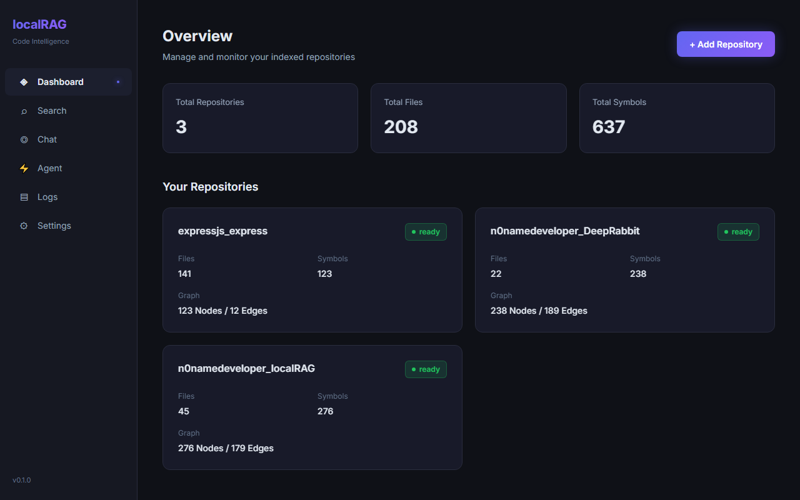
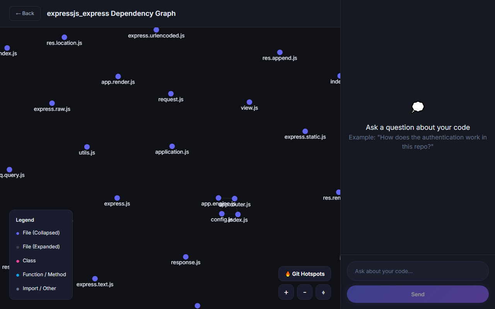
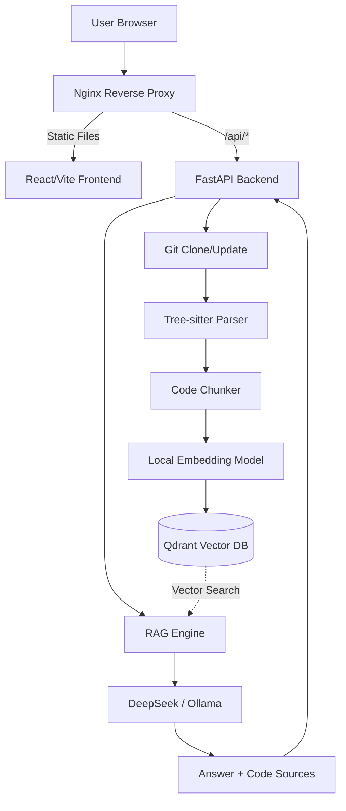

<div align="center">
  <h1>🤖 CodeRAG: Chat with GitHub Repositories</h1>
  <p>Chat with your GitHub repositories using Retrieval-Augmented Generation (RAG) and code-aware context. This project enables you to ask natural language questions about any GitHub repository and get precise answers with source code references, navigate repository graphs, and use an autonomous coding agent.</p>

  
</div>

---

## 🔍 Features

- **🧠 Code-Aware RAG**: Understands functions, classes, and dependencies using AST parsing (`tree-sitter`).
- **🔍 Semantic Search**: Find relevant code snippets instantly using vector embeddings (`BAAI/bge-m3`).
- **🕸️ Interactive Graph Traversal**: Visualizes codebase architecture, dependencies, and "Git Hotspots" (most frequently modified files).
- **🤖 Agent Mode**: Autonomous planning mode that creates step-by-step implementation plans for complex tasks.
- **🔗 GitHub Permalinks**: Answers include direct links to the exact lines of source code.
- **⚡ Streaming Responses**: Real-time chat experience with raw stream handling.
- **🌐 Multi-Language Support**: Works with Python, JavaScript, TypeScript, Java, Go, and more.
- **🦙 Local & Cloud LLMs**: Seamlessly switch between DeepSeek and local models via Ollama.

---

## 📸 Screenshots

### Dashboard & Repository Management

*Manage and index multiple repositories simultaneously.*

### Semantic Code Search

*Instantly find and understand specific code implementations.*

### Interactive Dependency Graph

*Navigate file dependencies and track Git Hotspots.*

### Agent Planning Mode

*Let the Agent generate comprehensive implementation plans.*

---

## 🏗️ Architecture



## 🛠️ Tech Stack

This project was recently modernized for maximum performance:

| Layer       | Technology         |
|-------------|--------------------|
| **Backend** | Python 3.12, FastAPI, `uv` (Package Manager) |
| **Frontend**| React, TypeScript, Vite, `bun` (Package Manager), Nginx |
| **Parsing** | tree-sitter        |
| **Embeddings**| Sentence Transformers (`BAAI/bge-m3` local execution) |
| **Vector DB** | Qdrant             |
| **LLMs**    | DeepSeek V4, Ollama (Llama 3, Qwen) |
| **Container** | Docker & Docker Compose |

---

## 🚀 Quick Start

### Prerequisites

- Docker & Docker Compose
- Git

### Installation

1. Clone the repository:
```bash
git clone https://github.com/n0namedeveloper/localRAG.git
cd localRAG
```

2. Copy the environment file:
```bash
cp .env.example .env
```

3. Edit `.env` and add your DeepSeek API Key (or configure Ollama in the UI later).

4. Build and start services (using our optimized Docker setup):
```bash
docker-compose up --build -d
```

5. Access the application:
   - **Web UI**: http://localhost:3000
   - **Backend API**: http://localhost:8000

---

## 📁 Project Structure

```text
.
├── backend/                 # FastAPI backend
│   ├── app/                 # API endpoints, RAG core, AST Ingestion
│   ├── Dockerfile           # Backend container (astral-sh/uv based)
│   └── pyproject.toml       # Python dependencies managed by uv
├── frontend/                # React Vite UI
│   ├── src/                 # React components and contexts
│   ├── nginx.conf           # Nginx reverse proxy configuration
│   ├── Dockerfile           # Frontend container (oven/bun based)
│   └── package.json         # Node dependencies managed by bun
├── data/                    # Ignored in git (Qdrant storage, cloned repos)
├── grammars/                # Tree-sitter compiled grammars
├── docker-compose.yml       # Optimized compose file (no exposed internal ports)
└── README.md
```

---

## ⚙️ Configuration

The `.env` file supports the following core configurations:

```env
# DeepSeek API
DEEPSEEK_API_KEY=your_api_key_here
DEEPSEEK_BASE_URL=https://api.deepseek.com/v1

# Qdrant Database
QDRANT_HOST=qdrant
QDRANT_PORT=6333

# Application limits
DATA_DIR=/app/data
MAX_CHUNKS_PER_QUERY=15
LOG_LEVEL=INFO
```
*Note: You can override LLM settings directly in the Web UI Settings tab.*

---

## 🤝 Contributing

1. Fork the repository
2. Create your feature branch (`git checkout -b feature/AmazingFeature`)
3. Commit your changes (`git commit -m 'Add some AmazingFeature'`)
4. Push to the branch (`git push origin feature/AmazingFeature`)
5. Open a Pull Request

## 📄 License

Distributed under the MIT License. See `LICENSE` for more information.

---
*Made with ❤️ and 🤖 by Artsiom Beniash. Make the world a better place to live! <3*